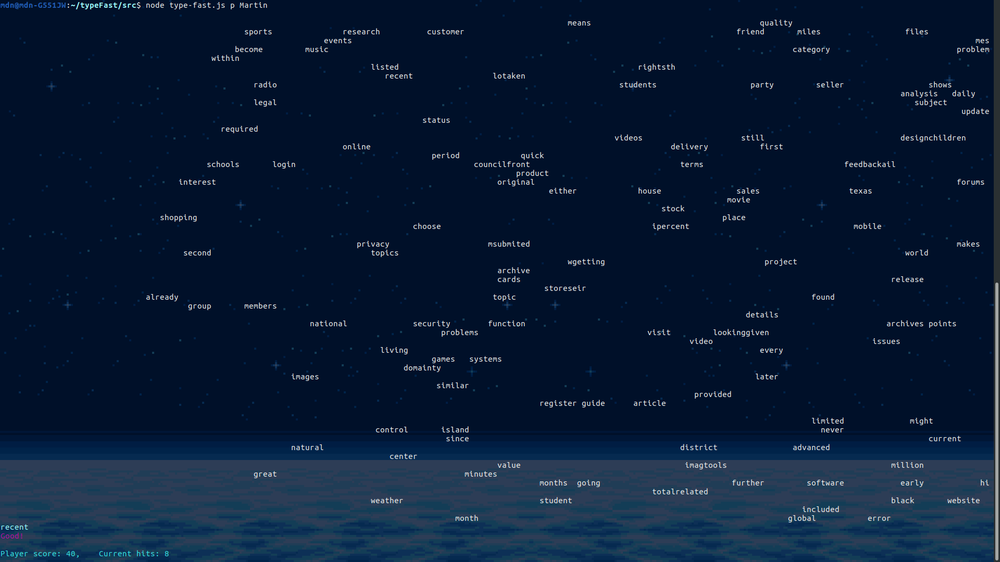

# Typing Fast in JavaScript
This is a simulation of the old DOS Type Fast games in JS.

---

## How the game works

When running the game, a player can either enter a name for his `player name` or just play the game.

The command that the game takes in:

	$ node type-fast.js --help

	  Usage: type-fast [options] [command]

	  	A Type Fast game!

	  Options:

    	-V, --version  output the version number
    	-h, --help     output usage information

	  Commands:

    	Player|p [player]  Enter your player name, then play the game.

---

## How to install

Clone the Git [repository](https://github.com/Anarcroth/type-fast-js.git).

Go to the cloned directory.

Type into the command line:

	npm --install
	
To run the game, move to the `/src` directory.

Type into the command line:

	node type-fast.js p [optional name]

---

## Screenshots

